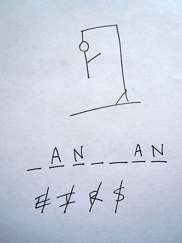
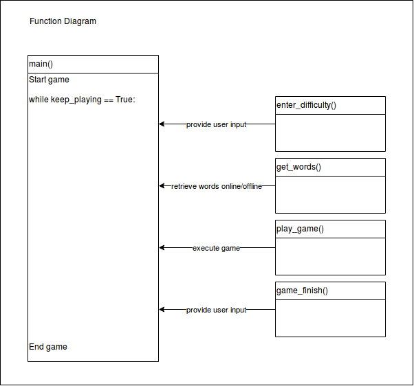
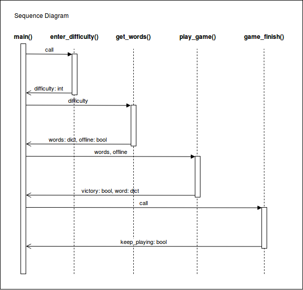
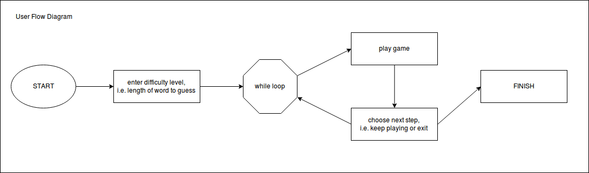

# petproject

This repository is used for an exemplary code project for the data science master module "Advanced Software Engineering" by Stefan Edlich

# Hangman

Hangman is a paper and pencil guessing game for two or more players. However, in this pythonic version of hangman, the human is not playing against another human but rather against the machine. To keep the game above expectations of excitement, the game automatically pulls the most difficult English words this planet has ever seen straight from the internet.

Good luck with that!

# The Game

The game is pretty much straight forward. The letters of an unknown word are displayed in the console. Your challenge is to guess the right letters in the word. If you guess wrong at least 10 times, you lose. If you guess all of the letters of the word correctly with less than 10 incorrect guesses you win!

Don't forget though, the words are among the most difficult in the world! Don't be disappointed if you always lose.

# UML

The above diagram displays all the functions used in the game and how the interact with each other. The main function is responsible to guide the user through the game along the user's input. Thus all other functions are connected via the main function.
Enter_difficulty receives the difficulty level from the user which get_words then uses to download a set of difficult words from the internet. Play_game then picks a word at random and plays down the game until the user wins or loses.
Finally, game_finish asks the user whether he or she wants to keep playing or exit the game.

Similar to the function diagram, the sequence diagram shows the essential role of the main function, connecting all other functions. Additionally, the sequence diagram also shows the parameters that are sent back and forth between the functions.

The userflow diagram is important for the user (and any other reviewer) to understand the game dynamics. The user starts the game by entering a level of difficulty, which is equal to the number of letters of the word that is to be guessed. Once the level has been set, the game starts and iterates through a while loop until the game is over. The game may be repeated, in which case the while loop is repeated, or it may be exited, in which case the game is over.

# SonarQube Scanner

SonarQube is able to inspect the code for bugs, vulnerabilities and code smells. After my first sonarqube inspection, the code had 1 bug which I then took care of (it was left code after a return statement). SonarQube outputs a report on their cloud server (which could be found here with login data: https://sonarcloud.io/dashboard?id=jabusch24_petproject) that gives an overview of the results:

# CodeClimate

The second tool used to check the code was code climate quality, which similarly runs through the software and creates metrics on maintainability rated the hangman game as C with 3 code smells, thus one more that sonarqube detected. CodeClimate did not like the size of some of my functions which i should consider refactoring. On the other side, sonarqube rated the projet's maintainability as "A", those both tools seem to have very different metric policies.

However, all measures have been rated as minor, as such the project does not pose any relevant threats. The report could also be found on https://codeclimate.com/github/jabusch24/petproject.

# CI/CD Pipeline

For continuous integration and delivery I used travis CI (https://travis-ci.org/jabusch24/petproject).

